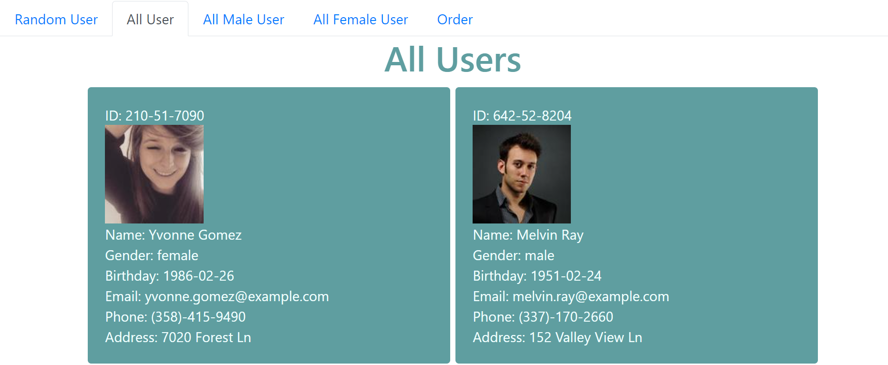
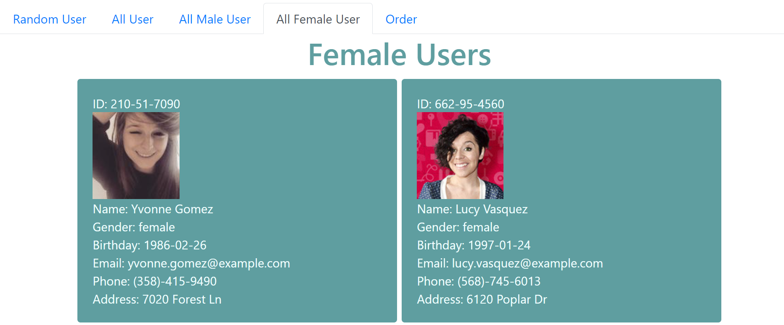
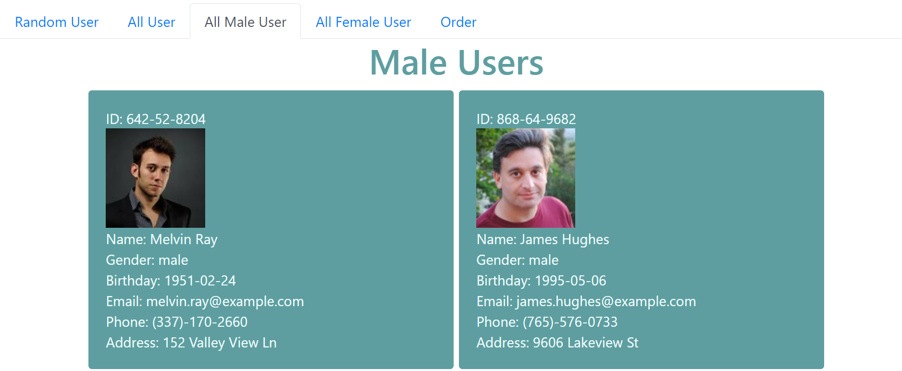
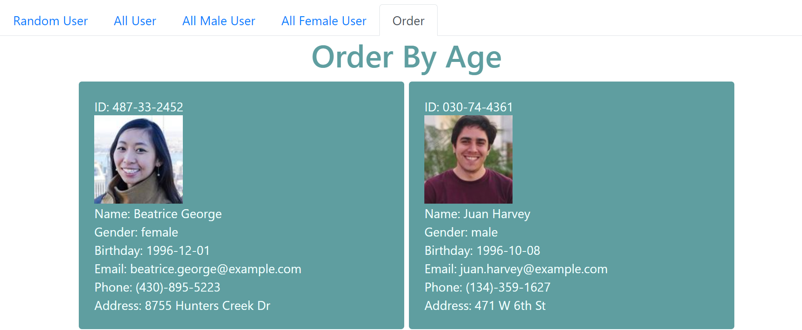

# HomeWork 19 User Directory

This project was bootstrapped with [Create React App](https://github.com/facebook/create-react-app).

[](https://opensource.org/licenses/MIT)


### Project Description

* A sample React application that auto render the user information
* The user information can only view female or male information
* The user information can be sort by there age
* The application is deploy on Github

### Usage
#### All User



#### Filter for all female



#### Filter for all male



#### Sort by age
- the user info will sort by age from young to old



### Language
```md
Javascrpit
React.JS
CSS
```

## About
* Project link: https://danielyu0864.github.io/DanielYu-HomeWork-19-User-Directory/
* Project Github: https://github.com/DanielYu0864/DanielYu-HomeWork-19-User-Directory
* Author: [`DanielYu0864`](https://github.com/DanielYu0864)

## Questions
*  For more question please contact me: adam741963@gmail.com


- - -
© 2020 - UW Coding Bootcamp Homework 19 User Directory by Daniel Yu
